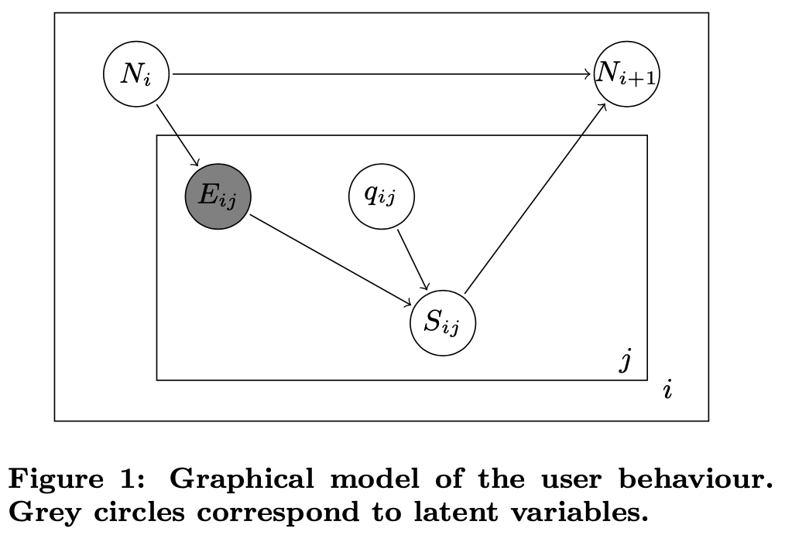

# Math UI Research

Ongoing research into the following question:

> What is the most elegant UI for writing mathematical formulas on a
> mobile device?

The motivation for answering this question came from my own
experience taking the [“Introduction to Mathematical Thinking”][1]
course on Coursera. I wanted to complete coursework assignments from
the comfort of my iPhone, reasoning that the more convenient I can
make it, the more likely I am to do the work.

I got quite far using Apple Notes and [SciKey][2] but the experience
of writing mathematical formulas (even simple ones) remained
cumbersome, error-prone and frustrating even after weeks of daily
practice.

My next line of investigation is into auto-completion. Would a
specialized keyboard that offered a choice of next-most-likely
mathematical expressions be effective? Would it be annoying to need
to look at the keyboard all the time? Could suggestions provided
closer to the formula being written? How would such a thing work? Can
ML and NLP techniques like word2vec be applied to mathematical
constructions?

## Query Auto Completion for Math Formula Search

To dig more into the final question above, I began by reading the
paper [“Query Auto Completion for Math Formula Search”][3] by Shaurya
Rohatgi, Wei Zhong, Richard Zanibbi, Jian Wu, and C. Lee Giles. What
follows are my notes from that paper.

> **Abstract**
>
> Query Auto Completion (QAC) is among the most appealing features of
> a web search engine. It helps users formulate queries quickly with
> less effort.

I don’t care about search UIs specifically, but I believe the
underpinnings will be relevant.

> Although there has been much effort in this area for text, to the
> best of our knowledge there is few work [sic] on mathematical formula
> auto completion.

This has been my experience too.

> In this paper, we implement 5 existing QAC methods on mathematical
> formula and evaluate them on the NTCIR-12 MathIR task dataset.

What is the “NTCIR-12 MathIR task dataset”?

Well, [NTCIR-12 MathIR][4] appears to be an academic project concerned with “Mathematical Information Retrieval”. In their words:

> Mathematical Information Retrieval is concerned with finding
> information in documents that include mathematics.

That gives us enough of an understanding for now. Returning to our
main paper…

> We report the efficiency of retrieved results using Mean Reciprocal
> Rank (MRR) and Mean Average Precision (MAP).

Might have to watch some YouTubes to understand these two statistical
analysis methods.

> Our study indicates that the Finite State Transducer outperforms
> other QAC models with a MRR score of 0.642.

“Finite State Transducer” sounds so cool it must be good.

> Keywords: Mathematical Information Retrieval (MIR), Query
> Auto-Complete (QAC)

Reading papers is a good way to learn terms to google for!

> Query auto completion (QAC) provides users with suggestions for
> their queries to enter as a search term. It helps users formulate
> their query correctly when they have an information need but no clear
> way to fully express it. It also helps avoid typographical errors,
> and reduces the input needed to query and thereby reducing the search
> duration, resulting in reduced search engine load and less resource
> usage, e.g., as reported by Bar-Yossef and Kraus. It was reported
> that the users of Yahoo! Search saved 50% of their keystrokes by
> selecting the queries suggested by QAC. Using less keystrokes
> before executing a search enhances user search experiences. Relevant
> query suggestions not only save time for users, but also make it
> easier to find the information needed, which increases user
> satisfaction.

This paper covers a slightly different use case, but the interaction
model is essentially the same as what I’m after. Furthermore, it
address the same questions I’m interested in:

1. How do you parse mathematical expressions?
2. How do you analyze a corupus of formulae?
3. What algorithms are best suited to auto-completion?

> While QAC for text input is a well-studied topic, QAC for math
> formula still remains an open research problem [4, 5].

4 and 5 refer to [Approach0][5] and [Symbolab][6], both extremely
interesting projects for math education.

> Mathematical Information Retrieval is gaining interest in recent
> years. For example, the NTCIR-12 competition contains challenging
> tasks to support math formula retrieval in documents. Text input
> QAC has been used in search engines like Baidu, Bing, and Google.
> However, due to many challenges, it is not widely used among math
> search engines, such 123456 as SearchOnMath, Springer Latex Search,
> Formulasearchengine, and Approach0. Symbolab and WolframAlpha
> supports QAC using prefix matching, but there is a lack of literature
> on this technique.

Interesting that Symbolab and WolframAlpha haven’t published anything
yet in this arena. Maybe they have by now?

> A challenge for math QAC is that the input in search boxes is not
> straightforward compared with plain text. Without a graphical
> interface where math equations can be drawn, a LATEX-like syntax is
> usually adopted.

LaTeX truly is the lingua franca of math on the web.

> Another challenge is the data structure used to store math formulae
> to facilitate searching. Similar to an inverted index, the
> prefix-tree is a commonly used data structure to store associations
> between prefix and query completions. These trees provide efficient
> lookups by matching prefixes.

TODO: Learn how to implement prefix tree and related procedures.

> A QAC system usually leverages query logs to calculate ranking
> scores. In the cold-start scenario, when the query log is absent, a
> math formula corpus can be used to make query completion suggestions.

I’m not too worried about query logs at first, but this would be a
good addition — the UI would learn the user’s most-commonly-entered
expressions.

> In this study, We use the NTCIR-12 Wikipedia corpus, containing
> 580,068 formulae to evaluate different QAC systems.

I could use this corpus too. I wonder if it can be easily downloaded?

> In the following sections we present background on query
> auto-completion in text and the lack of it in math, existing
> strategies, and our experiments using them with math formulae. We
> define a baseline for Math QAC by evaluating these auto-complete
> strategies using NTCIR-12 MathIR benchmark.

I’m not exactly sure what “baseline” means in this setting. I guess
the performance of each algorithm with no further optimization?

> **2. Related Work**

> Query auto completion techniques have been reviewed in several
> papers [5, 8, 9]. Here, we provide a brief summarization of the types
> of methods proposed and their features. QAC problems can be viewed as
> a form of ranking problem, given a query and a prefix-tree data
> structure. There are three categories of promising solutions making
> use of popularity, time, or similarity. Popularity-based methods
> use the frequency of query candidates past popularity, as measured
> using document frequency (i.e., occurrences in sentences) or
> frequency in query logs. The term occurrence ranker (TO) uses TF-IDF
> combined with term popularity.

TF-IDF? According to Wikipedia:

> term frequency–inverse document frequency, is a numerical statistic
> that is intended to reflect how important a word is to a document in
> a collection or corpus

I won’t read into this right now, but seems like an important result
in the field.

> Time-based approaches are based on session information. In time
> ranker (TR), the scores depend on time elapsed from the most recent
> occurrences in query logs. The most-popular time ranker (MT) combines
> most popular (MP) ranker and TR in form of a convex combination [1].

Again, I think I’d start with the corpus-based approach rather than
personalization via query log.

> Similarity-based methods weight query candidates by their
> similarity to user query logs or the documents previously clicked.
> Similarities can be measured as words, phrases, or context, e.g.
> n-gram similarity, semantic similarity, etc. [10] constrain search
> results in a given category using entity names input by the user. For
> example, after the user picked “Donald Trump”, an input prefix like
> “Sim” should not exactly prioritize famous singers like Paul Simon,
> who are not politicians. Although they appear important, they are
> unrelated to “Trump”.

Semantic analysis is probably a bit beyond me, but let‘s see what this
paper has to say on it. Also, this is a curious example — what “Sim”
would make sense in the context of Trump? 🤔

> QAC can also be categorized into two broad categories – heuristic
> models and learning based models, depending on whether machine
> learning methods are applied or not. The heuristic category
> includes classical QAC methods, which can be further divided into
> time-sensitive (e.g., most popular completion variances) and
> user-centered (e.g. personalization using session context For
> example, user’s actions such as skipped query completion and eye
> contact can also be used as implicit feedback.

Eye contact!

> Learning based models adopt many features to classify and rank
> candidates. Chien and Immorlica investigated the correlation between
> queries whose popularity behaves similarly over time. They could then
> find the highest correlated queries above a certain threshold to an
> input query.

So this was a technique that looked at historical correlation?

> Other learning features are related to patterns in access logs,
> entity names in queries, and demographics.

Demographics?

> “patterns in access logs” learns a model from query logs of Yandex,
> a popular Russian search engine, it defines a query-term graph to
> model likelihood of a sequence of query prefix. The graph they build
> is based on the steps that whether user examines the query suggested
> on the jth position or skips.

Slightly mangled sentence. [The paper they reference][7] is much more
complex. Here’s a graphic from it:

## Ideas for Further Investigation

- What does Wolfram do?
- What does PocketCAS do?
- Recommendation engines?
  - KNearest

[1]: https://www.coursera.org/learn/mathematical-thinking
[2]: https://apps.apple.com/us/app/scikey-scientific-keyboard/id927863083
[3]: https://arxiv.org/abs/1912.04115
[4]: http://ntcir-math.nii.ac.jp/
[5]: https://approach0.xyz/
[6]: https://www.symbolab.com/
[7]: http://terrierteam.dcs.gla.ac.uk/publications/kharitonov-sigir2013.pdf
