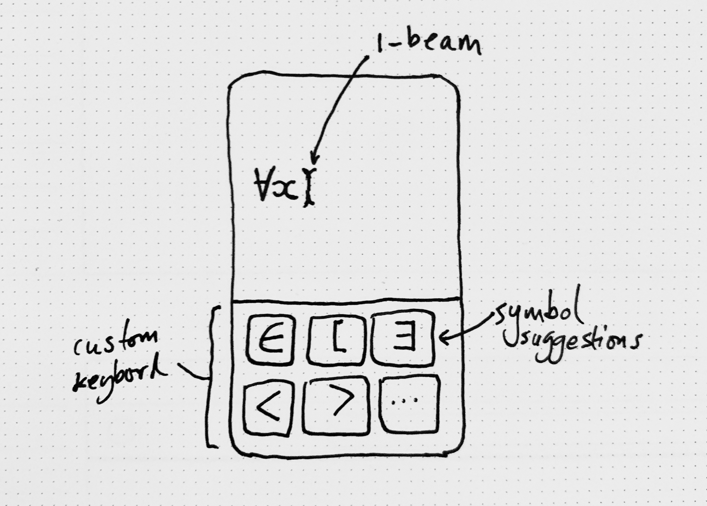

# Math UI Research

Ongoing research into the following question:

> What is the most elegant UI for writing mathematical formulas on a
> mobile device?

The motivation for answering this question came from my own
experience taking the [“Introduction to Mathematical Thinking”][1]
course on Coursera. I wanted to complete coursework assignments from
the comfort of my iPhone, reasoning that the more convenient I can
make it, the more likely I am to do the work.

I got quite far using Apple Notes and [SciKey][2] but the experience
of writing mathematical formulas (even simple ones) remained
cumbersome, error-prone and frustrating even after weeks of daily
practice.

My next line of investigation is into auto-completion. Would a
specialized keyboard that offered a choice of next-most-likely
mathematical expressions be effective? Would it be annoying to need
to look at the keyboard all the time? Could suggestions provided
closer to the formula being written? How would such a thing work? Can
ML and NLP techniques like word2vec be applied to mathematical
constructions?

## Query Auto Completion for Math Formula Search

To dig more into the final question above, I began by reading the
paper [“Query Auto Completion for Math Formula Search”][3] by Shaurya
Rohatgi, Wei Zhong, Richard Zanibbi, Jian Wu, and C. Lee Giles. What
follows are my notes from that paper.

> **Abstract**
>
> Query Auto Completion (QAC) is among the most appealing features of
> a web search engine. It helps users formulate queries quickly with
> less effort.

I don’t care about search UIs specifically, but I believe the
underpinnings will be relevant.

> Although there has been much effort in this area for text, to the
> best of our knowledge there is few work [sic] on mathematical formula
> auto completion.

This has been my experience too.

> In this paper, we implement 5 existing QAC methods on mathematical
> formula and evaluate them on the NTCIR-12 MathIR task dataset.

What is the “NTCIR-12 MathIR task dataset”?

Well, [NTCIR-12 MathIR][4] appears to be an academic project concerned with “Mathematical Information Retrieval”. In their words:

> Mathematical Information Retrieval is concerned with finding
> information in documents that include mathematics.

That gives us enough of an understanding for now. Returning to our
main paper…

> We report the efficiency of retrieved results using Mean Reciprocal
> Rank (MRR) and Mean Average Precision (MAP).

Might have to watch some YouTubes to understand these two statistical
analysis methods.

> Our study indicates that the Finite State Transducer outperforms
> other QAC models with a MRR score of 0.642.

“Finite State Transducer” sounds so cool it must be good.

## Ideas for Further Investigation

- What does Wolfram do?

[1]: https://www.coursera.org/learn/mathematical-thinking
[2]: https://apps.apple.com/us/app/scikey-scientific-keyboard/id927863083
[3]: https://arxiv.org/abs/1912.04115
[4]: http://ntcir-math.nii.ac.jp/
